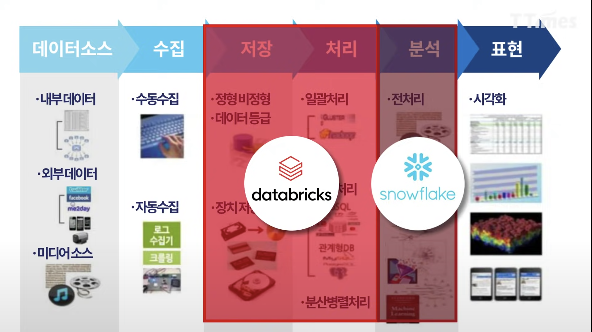

1. 오늘날 사용되고 있는 두 개의 주요 데이터베이스의 이름은?
> 운영 데이터베이스 - OLTP(Online Transaction Processing)에서 주로 사용. 책에서 초점을 맞춤
> 분석 데이터베이스 - OLAP(Online Analytical Processing)에서 주로 사용.

2. 분석 데이터베이스는 어떤 유형의 데이터를 저장하는가?
> 거의 변화가 없는 정적인 데이터

3. 참/거짓 문제: 운영 데이터베이스는 주로 OLTP(Online Transaction Processing) 업무에 사용된다.
> 참

4. 관계형 데이터베이스 모델 이전에 일반적으로 사용되었던 두 개의 데이터 모델은 무엇인가?
> 계층형 데이터베이스 모델, 네트워크 데이터베이스 모델

5. 부모/자식 관계에 대하여 설명하라.
> 계층형 데이터베이스에서 나타나는 관계를 가리킴. 계층형 데이터베이스에서는 자식테이블에 있는 레코드가 반드시 부모 테이블의 레코드와 연계되어야 함.

6. 집합 구조란 무엇인가?
> 네트워크 데이터베이스 모델에서 노드와 함께 초점을 맞추어 구현하고 있는 개념.
> 노드는 레코드의 모음을 표현하며, 집합 구조는 네트워크 데이터베이스 간 관계를 표현하고 설정한다.

7. 관계형 데이터베이스 모델은 수학 이론에 기초를 두고 있는데, 이 중 하나의 이름을 적으시오.
> 집합론과 1차 술어 논리

8. 관계형 데이터베이스 모델은 데이터를 어떻게 저장하는가?
> 테이블로 구현된 관계에 데이터를 저장한다.

9. 관계형 데이터베이스에 존재하는 관계의 세 가지 유형을 나열하시오.
> 1대1, 1대다, 다대다

10. 관계형 데이터베이스에서 데이터를 추출하는 방법을 설명하라.
> SQL을 사용해서 추출한다.

11. 관계형 데이터베이스의 두 가지 장점에 대하여 서술하라.
> 1) 내장된 다중 무결성
> 2) 데이터베이스 응용프로그램으로 부터 논리적, 물리적 데이터 독립성
> 3) 데이터의 일관성과 정확성을 보장
> 4) 쉬운 데이터 검색 

12. 관계형 데이터베이스 관리 시스템은 무엇인가?
> 관계형 데이터베이스를 생성하고, 유지보수하고, 수정하고, 조작할 때 사용하는 소프트웨어 응용프로그램

13. 객체-관계형 모델이 성립하기 위해서 어떤 전제조건이 필요한가?
> 클래스, 캡술화, 상속 등과 같은 다양한 객체 지향 요소와 특징들을 포함해야 한다.

14. 데이터 웨어하우스의 목적은 무엇인가?
> 비관계형 데이터베이스들에 저장된 데이터를 조직이 접근하여 기업의 의사결정을 돕도록 한다.

cf) 데이터 레이크: 빅데이터 시대에는 목적이 없는 데이터까지 무자비하게 넘쳐나고 있다 이것을 가리키는 용어
- 데이터 레이크의 데이터는 '자료 처리 과정(분류, 저장, 처리)'이 매우 중요함
- 처리방법#1) 호수에 있는 자료들을 정리해서 창고에 넣는 방법 
- 단점: 너무 많은 저장 공간 필요
- 처리방법#2) 필요할 때 마다 호수에서 데이터를 찾는 방법 
- 단점: 매번 시간 소요 
- 호수 내에서 정리를 해두고 곧바로 분석할 수 있게(데이터 브릭스-레이크 하우스:다양하고 많은 데이터들을 정리해서 곧바로 분석할수 있게 준비해둠. 정형데이터, 반정형데이터, 비정형데이터 보관) 
- 데이터 브릭스는 데이터 저장과 처리가 주요 영역
- 스노우플레이크는 어느정도 정제된 데이터를 분석하는 것이 주요 영역

