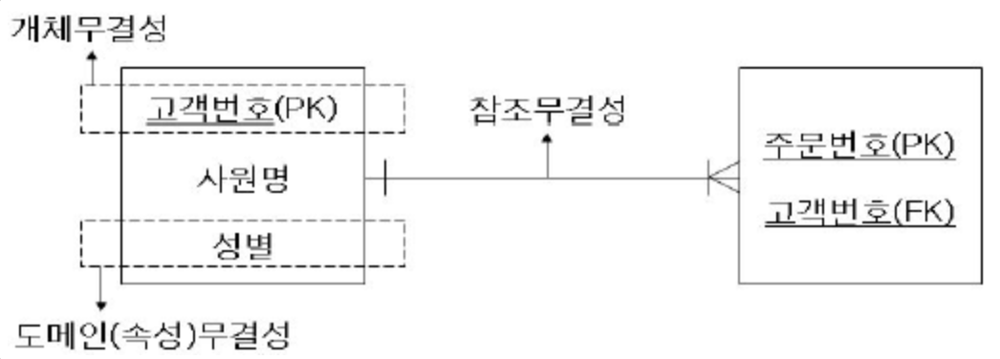

1. 전문 용어가 중요한 이유는 무엇인가?
> 1) 용어는 관계형 데이터베이스 모델에 대한 개념과 의견들을 정의하고 표현할 떄 사용된다.
> 2) 용어는 데이터베이스 설계 프로세스 자체를 정으하고 표현할 때 사용된다. 
> 3) 용어는 관계형 데이터베이스나 RDBMS에 대하여 이야기할 때면 언제나 사용된다.

2. 용어의 네 가지 범주의 이름은 무엇인가?
> 1) 값 관련 용어 
> 2) 구조 관련 용어
> 3) 관계 관련 용어
> 4) 무결성 관련 용어

3. 데이터와 정보의 차이는 무엇인가?
> 데이터는 데이터베이스에 저장된 값
> 정보는 데이터 중에서 일을 하거나 분석을 하기 위해 특정한 방법을 통해 의미 있고 실용적으로 재생성한 것들을 의미한다.
> 데이터를 몇 가지 방법으로 가공을 해서 의미 있는 결과로 바꿔야 정보라 볼 수 있다 

4. 널은 무엇을 표시하는가?
> 누락값이나 알려지지 않은 값을 표시한다. 수학적 연산에 부정적인 영향을 미치는 것에 주의해야 한다.

5. 널의 가장 큰 단점은 무엇인가?
> 널을 포함한 연산은 그 결과가 널로 나오기 때문에 의도하지 않은 결과를 얻을 수 있다.

6. 데이터베이스에 있는 주요 구조는 무엇인가?
> 테이블, 테이블로 인식되는 관계(데이터베이스의 데이터가 관계에 저장됨), 테이블은 튜플(레코드), 속성(필드)로 구성된다.

7. 테이블의 세 가지 종류는 무엇인가?
> 데이터 테이블, 룩업테이블이라는 이름으로 알려진 검증 테이블

8. 뷰는 무엇인가?
> 데이터베이스의 하나 이상의 테이블에서 여러 필드들을 혼합하여 만든 "가상"테이블 이다.

9. 키와 인덱스의 차이점은 무엇인지 서술하라.
> 테이블의 레코드를 식별할 때 사용하는 논리적인 구조가 키라면, 인덱스는 데이터 처리 속도를 최적화 할 때 사용하는 물리적 구조라는 둘 사이의 차이에 대하여 항상 알고 있어야 한다.
```
cf) Index 대상 컬럼 선정
일반적으로 Cardinality가 높은 컬럼을 우선적으로 인덱싱하는 것이 검색 성능에 유리합니다. Cardinality란 특정 데이터 집합의 유니크(Unique)한 값의 개수를 의미합니다.

남-여 등 2가지 값만 존재하는 성별 컬럼은 중복도가 높으며 카디널리티가 낮습니다.
개인마다 고유한 값이 존재하는 주민번호 컬럼은 중복도가 낮으며 카디널리티가 높습니다.
Cardinality 높은 컬럼의 경우, Index를 통해 데이터를 더 많이 필터링할 수 있기 때문입니다
```
- 출처: https://tecoble.techcourse.co.kr/post/2021-09-18-db-index/

10. 두 개의 테이블 사이에 존재할 수 있는 관계의 세 가지 종류는 무엇인가?
- 1:1
- 1:다
- 다:다

11. 관계를 특정 지을 수 있는 세 가지 방법은 무엇인가?
> 1) 관계의 유형(테이블들 사이에 존재하는 관계의 종류)
> 2) 참여의 유형(각 테이블에 참여하는 방법)
> 3) 참여의 정도(각 테이블에 참여하는 정도)

12. 필드 명세는 무엇인가?
> 도메인이라 알려진 필드 명세는 필드의 모든 요소를 표시한다.

13. 필드 명세를 구성하는 세 가지 요소는 무엇인가?
> 1) 일반적인 요소는 필드와 관련된 가장 기본적인 정보들의 의미
> 2) 물리적인 요소는 필드를 구성하는 방법과 이 필드를 사용하는 사람들에게 표시하는 방법을 결정
> 3) 논리적인 요소는 필드에 저장되는 값을 표시함

14. 데이터 무결성은 무엇인가?
> 데이터베이스에 있는 데이터의 유효성, 일관성, 정확성과 관련이 있다.
> Data integrity refers to the accuracy and consistency (validity) of data over its lifecycle.

15. 데이터 무결성의 네 가지 종류는 무엇인가?
- 테이블 수준 무결성(엔티티 무결성)
- 필드 수준 무결성(도메인 무결성)
- 관계 수준 무결성(참조 무결성)
- 업무 규칙

